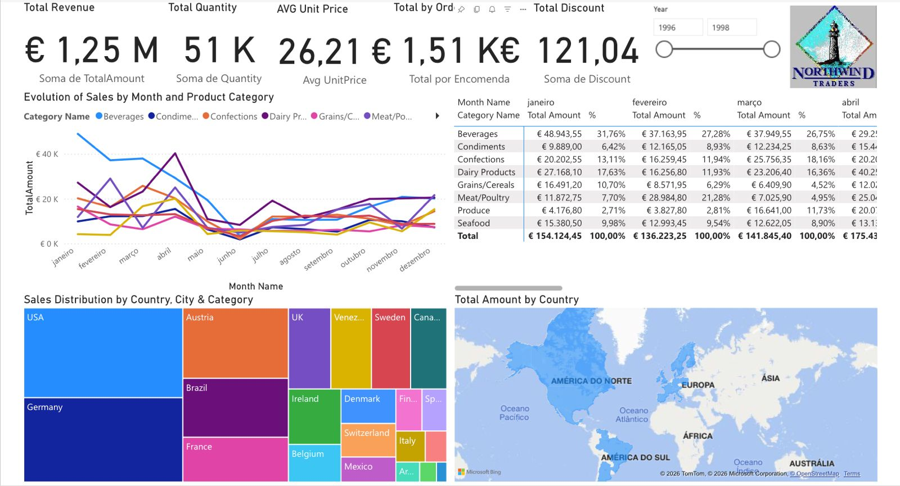
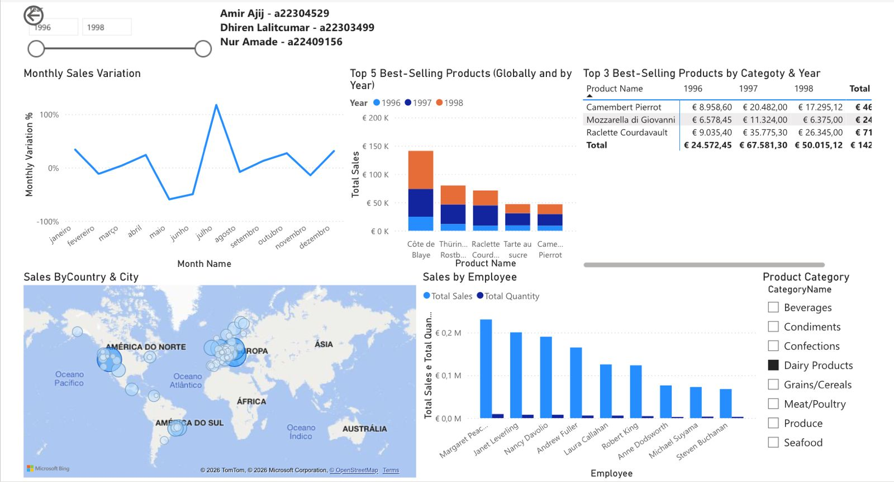

# Northwind Traders - Business Intelligence & Analytics Report

This project was developed for the **Decision Support Systems** (Sistemas de Suporte à Decisão) course. It focuses on transforming raw data from a Data Warehouse into actionable business insights using **Power BI** for Northwind Traders, a global food and beverage distributor.

## Project Overview
The goal was to act as a BI Consultant to build comprehensive management reports that allow stakeholders to perform descriptive and diagnostic analyses of sales performance, regional distribution, and employee efficiency.

## Tech Stack
* **Power BI Desktop**: Data visualization and dashboarding.
* **SQL Server**: Data source (NorthwindDW).
* **Power Query (M)**: ETL process (Extraction, Transformation, and Loading).
* **DAX (Data Analysis Expressions)**: Advanced calculations and business metrics.

## Data Preparation & Modeling
A rigorous ETL process was implemented to ensure data quality:
* **Data Cleaning**: Handled null values and standardized fields for Customers, Products, and Employees.
* **Modeling**: Created a Star Schema for optimized reporting.
* **Time Intelligence**: Developed a custom `Dim_Date` table to enable Year-over-Year (YoY) and Month-over-Month (MoM) comparisons.
* **Hierarchies**: Implemented drill-down capabilities for Geography (Country > City) and Products (Category > Product).

---

## Dashboard Insights

### 1. Sales Report: Executive Overview
This report provides a high-level look at the company's health.
* **Key KPIs**: Total Revenue, Quantity Sold, and Average Discount.
* **Time Analysis**: Monthly sales evolution categorized by product type.
* **Geographic Distribution**: Interactive Map and Tree Map showing top-performing markets.
* **Performance Matrix**: A detailed breakdown of monthly sales with percentage distributions.

**Preview:**

---

### 2. Sales Report: Operational Efficiency & Rankings
Focused on granular data and ranking performance.
* **Growth Metrics**: Monthly variation analysis to identify sales trends.
* **Top Performers**: Dynamic rankings for the Top 5 products and Top 3 products per category/year.
* **Human Resources**: Evaluation of sales performance (Value vs. Quantity) per employee.
* **Advanced Slicers**: Multi-dimensional filtering by Year and Category.

**Preview:**

---

## Repository Structure
* `Script_NorthwindDW.sql` used to build the database.
* `Northwind_Analytics.pbix`: The main Power BI project file.
* `Sales_Report_1.pdf` & `Sales_Report_2.pdf`: Exported versions of the final reports.

## How to Use
1. Clone this repository.
2. Ensure you have [Power BI Desktop](https://powerbi.microsoft.com/) installed.
3. Open the `.pbix` file to explore the interactive filters and data model.

---
**Academic Context:** Developed at Universidade Lusófona (2024/25).  
**Author:** [Amir Ajij]
